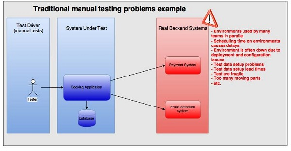
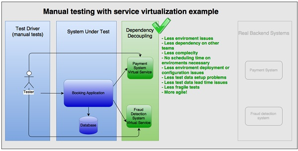

# Mocking Database 

#### By Andres Felipe Rincon

---
# Agenda

- Basics
- Mocking a database could be a challenge
- Solving the problem
    - Living database. 
     - Embedded
     - Local

---

# Basics

---
## Common Problems

Note:
The most frequent problems when we are testing a system are the external dependencies, so the tests turn fragile since there are many moving parts.
---
## Solution

---
### Service Virtualization

---

- Create a testing system before integration testing 
- Using **virtual services** or **stubs** instead of the real ones  

Note: 
One way of solving the issues of too many dependencies and too many moving parts is by doing system testing before integration testing with external backend systems (Figure 2). Using virtual services or stubs, allow you to decouple the testing from the real backend systems. The problems mentioned above, either disappear or lose priority. People are happy for a while. 

---
## Concepts

---
## Stubs

Minimal implementation of an interface that normally return hardcoded data

---

## Mock 
Programmable interface observer, that verifies the outputs against expectations defined bt the test.

---
## Virtual Services
Test double often provided as SaaS, it's always called remotely.  

A virtual service is often created by recording traffic using one of the service virtualization platforms instead of building the interaction pattern from scratch based on interface or API documentation.