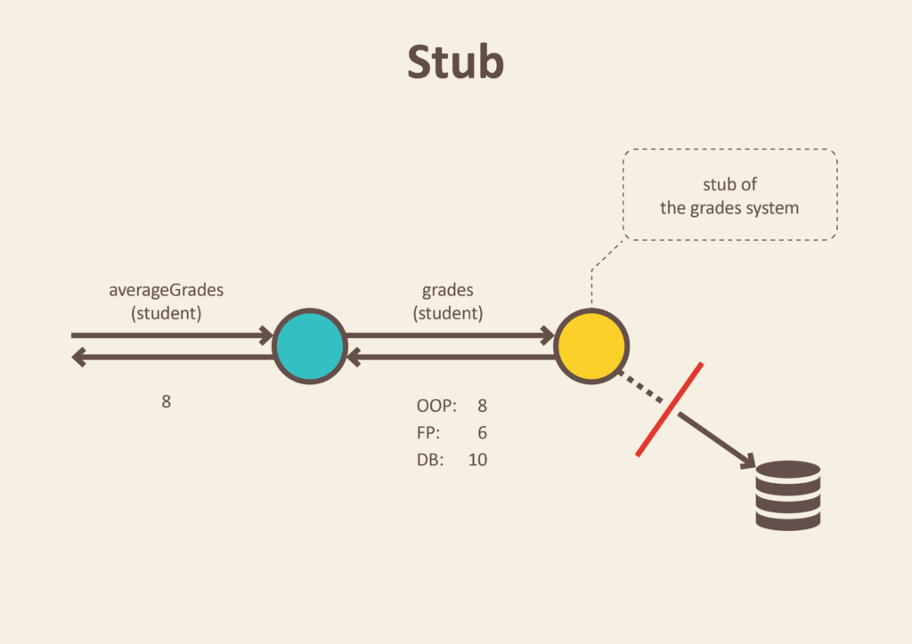

# Mocking Database 

#### By Andres Felipe Rincon

---
# Agenda

- Basics
- Mocking a database

---

# Basics

---
## Common Problems


Note:
The most frequent problems when we are testing a system are the external dependencies, so the tests turn fragile since there are many moving parts.
---
## Solution

---
### Service Virtualization


---

- Create a testing system before integration testing 
- Using **virtual services** or **stubs** instead of the real ones  

Note: 
One way of solving the issues of too many dependencies and too many moving parts is by doing system testing before integration testing with external backend systems (Figure 2). Using virtual services or stubs, allow you to decouple the testing from the real backend systems. The problems mentioned above, either disappear or lose priority. People are happy for a while. 

---
## Concepts

---
### Stubs

Minimal implementation of an interface that normally return hardcoded data

---



---

Stub Object

```java
public class GradesService {
    private final Gradebook gradebook;
    
    public GradesService(Gradebook gradebook) {
        this.gradebook = gradebook;
    }
    
    Double averageGrades(Student student) {
        return average(gradebook.gradesFor(student));
    }
}
```

---
Instead of calling database from Gradebook store to get real students grades, we preconfigure stub with grades that will be returned. We define just enough data to test average calculation algorithm.

+++ 
@title[Stub Sample Block]

```java 
public class GradesServiceTest {
    private Student student;
    private Gradebook gradebook;

    @Before
    public void setUp() throws Exception {
        gradebook = mock(Gradebook.class);
        student = new Student();
    }

    @Test
    public void calculates_grades_average_for_student() {
        when(gradebook.gradesFor(student)).thenReturn(grades(8, 6, 10)); //stubbing gradebook
        double averageGrades = new GradesService(gradebook).averageGrades(student);
        assertThat(averageGrades).isEqualTo(8.0);
    }
}
```
---
### Mock 

Programmable interface observer, that verifies the outputs against expectations defined by the test.

---


---
We don’t want to close real doors to test that security method is working, right? Instead, we place door and window mocks objects in the test code.

+++
@title[Mock Sample Block]

```java

public class SecurityCentral {
    private final Window window;
    private final Door door;

    public SecurityCentral(Window window, Door door) {
        this.window = window;
        this.door = door;
    }

    void securityOn() {
        window.close();
        door.close();
    }
}
```
---

```java

public class SecurityCentralTest {
    Window windowMock = mock(Window.class);
    Door doorMock = mock(Door.class);

    @Test
    public void enabling_security_locks_windows_and_doors() {
        SecurityCentral securityCentral = new SecurityCentral(windowMock, doorMock);
        securityCentral.securityOn();
        verify(doorMock).close();
        verify(windowMock).close();
    }
}

```

---
### Virtual Services

**Test double** often provided as SaaS, it's always called remotely.  

A virtual service is often created by recording traffic using one of the service virtualization platforms instead of building the interaction pattern from scratch based on interface or API documentation.

---
### Test Double

Generic term for any kind of pretend object used in place of a real object for testing purposes.

---
#### Common categories of test double

---
##### dummy 
object (a string “Mike”)

---
##### stub 
a StubUserRepository class that always returns user object representing a male named John, age 32, living in US

---
##### spy
a SpyHttpResponse class that records all invocations of the onPost method

---
##### fake
a FakeDatabase class which persists to an in memory H2 database instead of the DB2 production system

---
##### mock
a dynamic proxy implementation of OrderObserver interface, implemented by Mockito and used in a **unit test**

---
Common categories of a test double used for testing and quality assurance:

- **stub** (a servlet in a WAR file created using SoapUI and deployed to a remote Jetty instance at http://testEnv.mycompany.com/getWeatherService)
- **virtual service** (an artifact created with a service virtualization tool and deployed to a remote shared virtual service environment at http://vsenv.mycompany.com:9034/getWeatherService)

---
## What should we use?

|   |data source| created by | used by|
|---|-----------|------------|--------| 
| Stub | Hardcoded data | DEVs/testers| DEVs/testers|
| Mock | Data set up by the test | DEVS | DEVs |
| Virtual Service | Recorded data | Testers | Testers |

---
# Mocking database

---
## Fake database (Virtualization)

Using a memory database like H2 who behaves as our transactional database. 

---
### H2

- It is an open source database built in Java who supports SQL and JDBC API. 
- This database can emulate the behavior of specific databases as: 
    - DB2
    - Derby
    - HSQLDB
    - MS SQL Server
    - MYSQL 
    - ORACLE
    - POSTGRES
--- 
### H2 Sample


---
## Embedded Database
Set up a database as part of your development process, and use it when you are executing your integration tests.

---
### What is it? 

Note: An embedded database is a database technology in which database management solutions are built into an application rather than provided as standalone tools. In many cases, this effectively "hides" the database management tools from the end user.

---?code=https://github.com/yohanliyanage/blog-mongo-integration-tests/blob/master/mongo-it/src/test/java/com/yohanliyanage/blog/mongoit/repository/SampleRepositoryMongoImplIntegrationTest.java

---
# Thanks 


